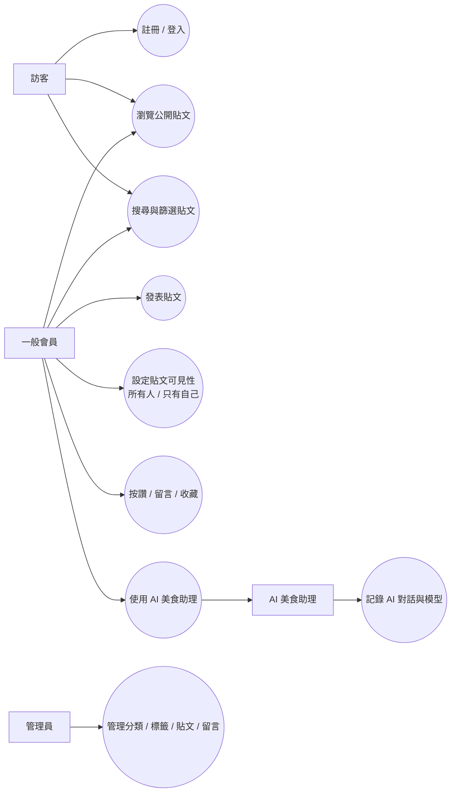

# 🍴 等等吃啥（EatWhat）

這是一個「美食分享＋選擇困難救星」的小平台。大家可以發文、看文、用標籤/分類找靈感，還能按讚、留言、收藏。

---

## 使用者故事（User Story）

> 身為一個面對三餐要吃啥，每次都選擇困難的使用者，我希望可以用「分類/標籤」去找貼文，參考別人的美食分享，讓我更快決定要吃什麼。

---

## 核心願景

- **現在要做的事**：幫大家解決「午餐/晚餐不知道吃什麼」。
- **未來可以做的事**：如果之後發現大家常吃高熱量外食，可以再加上「熱量分析」或「健康標籤」等功能，讓吃飯更健康。

---

## 系統需求（System Requirements）

### 功能性需求（Functional Requirements）

| 模組 | 用到的功能 | 狀態 |
| :--- | :--- | :---: |
| 會員管理 | 註冊、登入/登出、個人資料與頭像 |
| 社群貼文 | 發文（最多 3 張附圖）、看貼文、按讚、巢狀留言 | 
| 搜尋篩選 | 關鍵字搜尋、分類/標籤篩選 | 
| 互動追蹤 | 收藏貼文、追蹤會員、留言按讚 |
| 後台管理 | 管理員可管理使用者/貼文/留言/分類/標籤 |

### 非功能性需求（Non-functional Requirements）

- **資料庫**：MariaDB（關聯式資料庫）
- **安全**：Django 密碼雜湊、CSRF 防護
- **效能**：列表查詢使用 `select_related()` / `prefetch_related()` 等方式減少查詢次數
- **防呆**：搜尋字數、留言長度、重複寫入搜尋紀錄等都有基本處理

---

## 💻 技術棧（Tech Stack）

- **Backend**：Django 5.x（Python）
- **Database**：MariaDB 10.x
- **Frontend**：HTML + Tailwind CSS + Django Template（搭配 Django Form/Widget）
- **DevOps**：Git、HeidiSQL

---

## ERD / DBML（資料表設計）

DBML：

```text
Table users {
  id integer [primary key]
  username varchar [unique]
  password varchar
  email varchar [unique]
  role varchar [default: 'member']
  created_at timestamp
}

Table profiles {
  user_id integer [primary key, unique]
  avatar varchar
  bio text
  dietary_preference varchar
}

Table categories {
  id integer [primary key]
  name varchar
}

Table tags {
  id integer [primary key]
  name varchar [unique]
}

Table search_logs {
  id integer [primary key]
  user_id integer
  keyword varchar
  created_at timestamp
}

Table posts {
  id integer [primary key]
  user_id integer
  category_id integer
  title varchar
  content text
  image_url varchar
  image2 varchar
  image3 varchar
  visibility varchar [default: 'public', note: 'public/private']
  like_count integer [default: 0]
  created_at timestamp
  updated_at timestamp
}

Table posts_tags {
  id integer [primary key]
  post_id integer
  tag_id integer
}

Table likes {
  id integer [primary key]
  post_id integer
  user_id integer
  created_at timestamp
}

Table post_comment {
  id integer [primary key]
  post_id integer
  user_id integer
  parent_id integer [null]
  root_id integer [null]
  content text
  like_count integer [default: 0]
  created_at timestamp
  updated_at timestamp
  is_locked boolean [default: false]
  is_pinned boolean [default: false]
}

Table post_comment_likes {
  id integer [primary key]
  user_id integer
  comment_id integer
  created_at timestamp
}

Table follows {
  id integer [primary key]
  follower_id integer
  following_id integer
  created_at timestamp
}

Table collections {
  id integer [primary key]
  user_id integer
  post_id integer
  created_at timestamp
}

Table ai_chat_logs {
  id integer [primary key]
  user_id integer
  message text
  image varchar [null]
  assistant_reply text
  model_name varchar
  created_at timestamp
}

Ref: profiles.user_id - users.id
Ref: posts.user_id > users.id
Ref: posts.category_id > categories.id
Ref: posts_tags.post_id > posts.id
Ref: posts_tags.tag_id > tags.id
Ref: search_logs.user_id > users.id
Ref: post_comment.post_id > posts.id
Ref: post_comment.user_id > users.id
Ref: post_comment.parent_id > post_comment.id
Ref: post_comment.root_id > post_comment.id
Ref: post_comment_likes.user_id > users.id
Ref: post_comment_likes.comment_id > post_comment.id
Ref: likes.post_id > posts.id
Ref: likes.user_id > users.id
Ref: follows.follower_id > users.id
Ref: follows.following_id > users.id
Ref: collections.user_id > users.id
Ref: collections.post_id > posts.id
Ref: ai_chat_logs.user_id > users.id
```

## 用例圖（Use Case）



## 🚀 開發人員同步指南

### 1. 安裝套件

```powershell
pip install -r requirements.txt
```

### 2. 建立 MariaDB 資料庫

- Database Name：`eat_what`
- Collation：`utf8mb4_unicode_ci`

### 3. 設定資料庫連線

到 `mysite/settings.py` 修改 `DATABASES`（改成自己的帳密與 port）。

### 4. 建表

```powershell
python manage.py migrate
```

### 5. 建superuser

```powershell
python manage.py createsuperuser
```

### 6. 啟動

```powershell
python manage.py runserver
```

