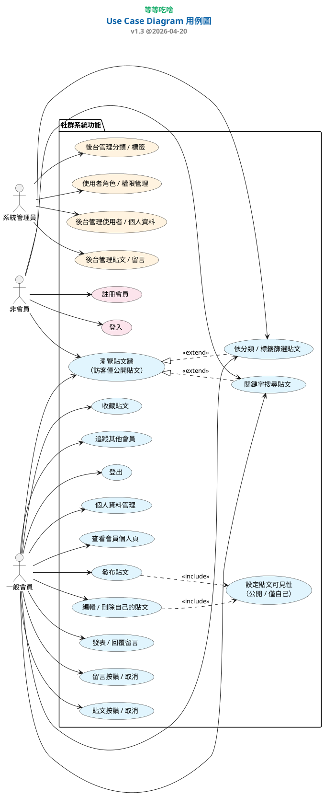

# 🍴 等等吃啥（EatWhat）

美食分享小站：發文、看文、用分類與標籤找靈感，還能按讚、留言、收藏與追蹤。

---

## 使用者故事（User Story）

> 不知道要吃什麼時，我想用分類或標籤瀏覽貼文，參考別人的分享，更快決定要吃什麼。

---

## 核心願景

- **現在**：幫大家少一點「今天吃什麼」的選擇困難。
- **之後可擴充**：例如熱量、健康標籤等（視需求再規劃）。

---

## 系統需求

### 功能性需求

| 模組 | 說明 | 狀態 |
| --- | --- | :---: |
| 會員 | 註冊、登入／登出、個人檔案（頭像、簡介、飲食偏好等） | 已完成 |
| 貼文 | 發文（富文字、最多 3 張圖）、公開／僅自己可見；動態牆與單篇瀏覽（未登入只能看公開貼文）；按讚；巢狀留言與回覆 | 已完成 |
| 搜尋篩選 | 關鍵字；分類與標籤可多選篩選；登入後會記錄搜尋關鍵字（方便之後做統計） | 已完成 |
| 互動 | 收藏貼文、追蹤會員、留言按讚 | 已完成 |
| 後台 | 管理會員與個檔、貼文與留言、分類與標籤，以及按讚／收藏／追蹤／搜尋紀錄等；貼文可匯出 CSV、重算讚數 | 已完成 |

### 非功能性需求

- **資料庫**：MariaDB。
- **安全**：密碼雜湊、CSRF；敏感設定放在 `.env`，不要 commit 進 Git。
- **效能**：列表盡量用 `select_related` / `prefetch_related` 減少查詢次數。
- **防呆**：搜尋字數上限、留言長度、表單驗證、搜尋紀錄節流等基本處理。

---

## 技術棧

- **後端**：Django 5.x（Python）
- **資料庫**：MariaDB 10.x
- **畫面**：HTML、Tailwind、Django Template；Alpine.js（部分互動）、Font Awesome（圖示）
- **貼文編輯**：django-ckeditor（富文字與圖片）
- **後台匯出**：django-import-export
- **工具**：Git、HeidiSQL

---

## 資料表（DBML 摘要）

```text
Table users {
  id integer [primary key]
  username varchar [unique]
  password varchar
  email varchar [unique]
  role varchar [default: 'member']
  created_at timestamp
}

Table profiles {
  user_id integer [primary key, unique]
  avatar varchar
  bio text
  dietary_preference varchar
}

Table categories {
  id integer [primary key]
  name varchar
}

Table tags {
  id integer [primary key]
  name varchar [unique]
}

Table search_logs {
  id integer [primary key]
  user_id integer
  keyword varchar
  created_at timestamp
}

Table posts {
  id integer [primary key]
  user_id integer
  category_id integer
  title varchar
  content text
  image_url varchar
  image2 varchar
  image3 varchar
  visibility varchar [default: 'public', note: 'public/private']
  like_count integer [default: 0]
  created_at timestamp
  updated_at timestamp
}

Table posts_tags {
  id integer [primary key]
  post_id integer
  tag_id integer
}

Table likes {
  id integer [primary key]
  post_id integer
  user_id integer
  created_at timestamp
}

Table post_comment {
  id integer [primary key]
  post_id integer
  user_id integer
  parent_id integer [null]
  root_id integer [null]
  content text
  like_count integer [default: 0]
  created_at timestamp
  updated_at timestamp
  is_locked boolean [default: false]
  is_pinned boolean [default: false]
}

Table post_comment_likes {
  id integer [primary key]
  user_id integer
  comment_id integer
  created_at timestamp
}

Table follows {
  id integer [primary key]
  follower_id integer
  following_id integer
  created_at timestamp
}

Table collections {
  id integer [primary key]
  user_id integer
  post_id integer
  created_at timestamp
}

Table ai_chat_logs {
  id integer [primary key]
  user_id integer
  message text
  image varchar [null]
  assistant_reply text
  model_name varchar
  created_at timestamp
}

Ref: profiles.user_id - users.id
Ref: posts.user_id > users.id
Ref: posts.category_id > categories.id
Ref: posts_tags.post_id > posts.id
Ref: posts_tags.tag_id > tags.id
Ref: search_logs.user_id > users.id
Ref: post_comment.post_id > posts.id
Ref: post_comment.user_id > users.id
Ref: post_comment.parent_id > post_comment.id
Ref: post_comment.root_id > post_comment.id
Ref: post_comment_likes.user_id > users.id
Ref: post_comment_likes.comment_id > post_comment.id
Ref: likes.post_id > posts.id
Ref: likes.user_id > users.id
Ref: follows.follower_id > users.id
Ref: follows.following_id > users.id
Ref: collections.user_id > users.id
Ref: collections.post_id > posts.id
Ref: ai_chat_logs.user_id > users.id
```

---

## 用例圖（PlantUML）

未登入可瀏覽公開貼文並搜尋／篩選；按讚、留言、發文等需登入。若 GitHub 無法預覽圖，可貼到 [PlantUML Live](https://www.plantuml.com/plantuml/uml/) 或 VS Code PlantUML 外掛。



---

## 本機開發步驟

### 1. 安裝套件

```powershell
pip install -r requirements.txt
```

### 2. 建立資料庫

- 名稱：`eat_what`
- Collation：`utf8mb4_unicode_ci`

### 3. 連線設定

在 `mysite/settings.py` 的 `DATABASES` 填入自己的帳密與 port（或依專案慣例用環境變數）。

### 4. 建表

```powershell
python manage.py migrate
```

### 5. 建立管理員

```powershell
python manage.py createsuperuser
```

### 6. 啟動

```powershell
python manage.py runserver
```
