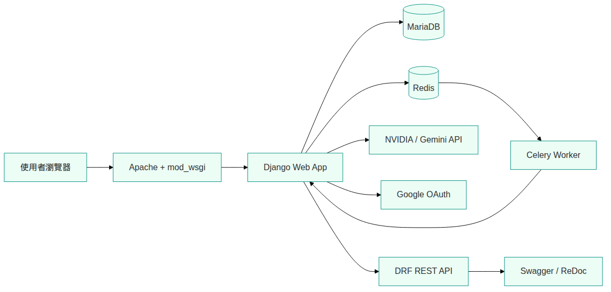
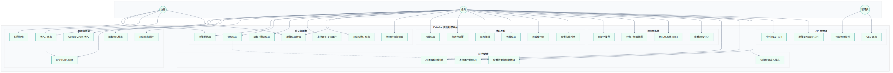
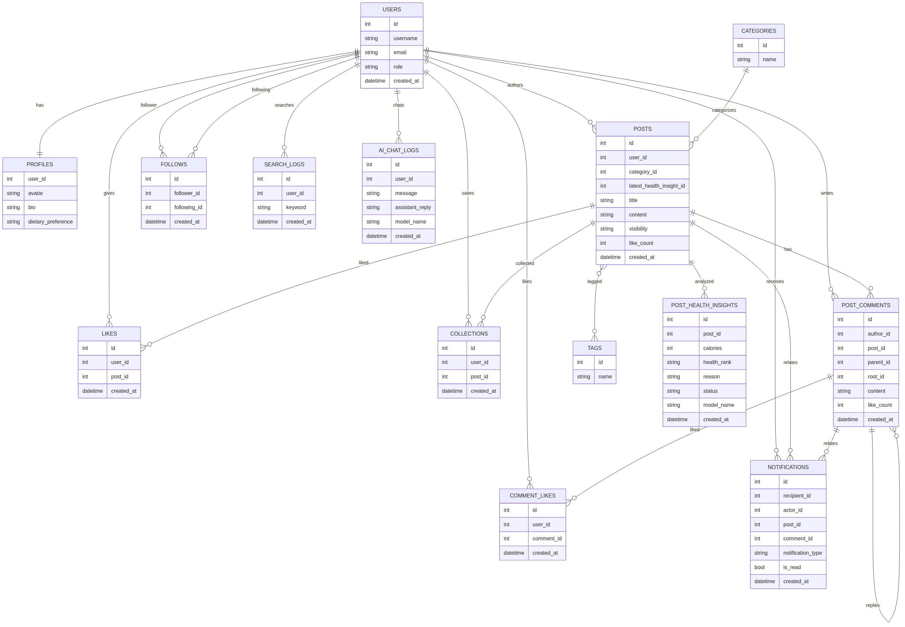
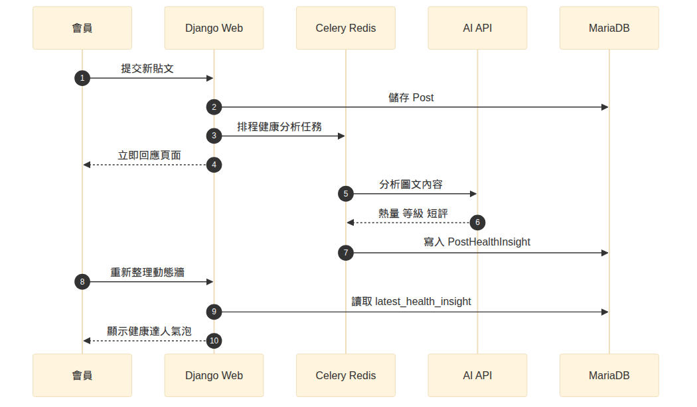
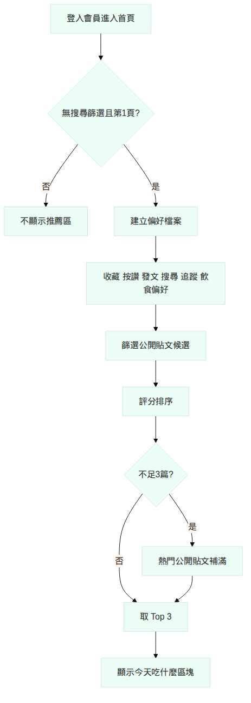

# EatWhat（等等吃啥）專題文件

> 適用於 Notion 匯入或複製貼上。圖表 PNG 位於同資料夾 `images/`。

---

## 專題概要

| 項目 | 內容 |
| --- | --- |
| 專題名稱 | 等等吃啥 EatWhat |
| 類型 | 美食社群平台 |
| 原始碼 | https://github.com/11146076/djangotutorial |
| 分支 | `main` |
| 本機網址 | http://localhost/ |
| 技術棧 | Django 5、MariaDB、Redis、Celery、DRF、Tailwind |

### 一句話介紹

EatWhat 是整合 **發文互動、個人化推薦、健康達人模式、AI 美食助理、通知中心、Google OAuth 與 REST API** 的美食社群平台。

---

## 系統架構圖



**說明：** 使用者透過 Apache 連線 Django，資料存於 MariaDB；健康分析等背景任務由 Celery + Redis 處理；AI 與 Google OAuth 為外部服務整合。

---

## Use Case 圖（用例圖）



### 角色說明

| 角色 | 說明 |
| --- | --- |
| 訪客 | 可瀏覽公開動態牆、註冊、登入（含 Google OAuth） |
| 會員 | 發文、互動、搜尋、推薦、通知、AI 助理、健康模式、API |
| 管理員 | Django 後台管理、CSV 匯出 |

### 用例分組

| 模組 | 主要用例 |
| --- | --- |
| 認證與帳號 | 註冊、登入/登出、CAPTCHA、Google OAuth、個人檔案、飲食偏好 |
| 貼文與瀏覽 | 動態牆、發文、編輯刪除、圖片上傳、公開/私密、分類標籤 |
| 社群互動 | 按讚、留言回覆、留言讚、收藏、追蹤 |
| 探索與推薦 | 搜尋、篩選、Top 3 推薦、通知中心 |
| AI 與健康 | AI 對話、健康達人模式、熱量/等級顯示 |
| API 與管理 | REST API、Swagger、後台管理 |

---

## ERD 圖（實體關聯圖）



### 核心資料表

| 資料表 | 說明 |
| --- | --- |
| `users` | 會員帳號（繼承 Django AbstractUser） |
| `profiles` | 大頭貼、簡介、飲食偏好（1:1） |
| `posts` | 貼文主檔，含最多 3 張圖、可見性、讚數 |
| `categories` / `tags` | 分類與標籤 |
| `likes` / `collections` | 按讚與收藏 |
| `follows` | 追蹤關係（follower → following） |
| `post_comment` | 留言與樹狀回覆 |
| `post_comment_likes` | 留言按讚 |
| `post_health_insights` | AI 健康分析（熱量、A–D 等級） |
| `notifications` | 站內通知 |
| `search_logs` | 搜尋紀錄（供推薦使用） |
| `ai_chat_logs` | AI 美食助理對話紀錄 |

### 重要關聯

- `posts.latest_health_insight_id` → 指向最新一筆健康分析
- `posts` ↔ `tags` 為多對多（M:N）
- `notifications` 同時關聯 `recipient`、`actor`、`post`、`comment`

---

## 流程圖

### 健康分析流程



### 個人化推薦流程



**推薦顯示條件：** 已登入、首頁第 1 頁、無搜尋/分類/標籤篩選。

---

## 功能清單（完成狀態）

| 功能 | 狀態 | 路徑 / 備註 |
| --- | :---: | --- |
| 會員註冊登入 + CAPTCHA | ✅ | `/accounts/login/` |
| Google OAuth | ✅ | `/oauth/` |
| 富文字發文（最多 3 圖） | ✅ | 動態牆發文表單 |
| 按讚 / 留言 / 收藏 / 追蹤 | ✅ | 貼文詳情 |
| 搜尋與篩選 | ✅ | 首頁篩選列 |
| 個人化推薦 Top 3 | ✅ | 首頁「今天吃什麼？」 |
| 通知中心 | ✅ | `/notifications/` |
| AI 美食助理 | ✅ | 浮動對話視窗 |
| 健康達人模式 | ✅ | 動態牆切換開關 |
| REST API + Swagger | ✅ | `/api/docs/` |
| Django 後台 | ✅ | `/admin/` |

---

## 畫面截圖區（請自行補上）

> 以下為建議截圖位置。請在本機 `http://localhost/` 操作後，將圖片拖入 Notion 對應區塊。

### 01 — 部署環境

- [ ] Apache / MariaDB 服務狀態（終端機）
- [ ] GitHub `main` 分支最新 commit

### 02 — 會員與 OAuth

- [ ] 登入頁（含 CAPTCHA）
- [ ] Google 登入按鈕
- [ ] 個人檔案編輯頁

### 03 — 核心功能

- [ ] 首頁動態牆 + 推薦 3 篇
- [ ] 發文頁（CKEditor）
- [ ] 貼文詳情 + 留言
- [ ] 健康達人模式 ON
- [ ] 通知中心
- [ ] 搜尋 / 篩選結果

### 04 — AI 與 API

- [ ] AI 美食助理對話
- [ ] Swagger API 文件
- [ ] Django 後台

---

## API 端點一覽

| 資源 | 端點 |
| --- | --- |
| 貼文 | `GET/POST /api/v1/posts/` |
| 留言 | `/api/v1/comments/` |
| 通知 | `/api/v1/notifications/` |
| 收藏 | `/api/v1/collections/` |
| 分類 | `/api/v1/categories/` |
| 標籤 | `/api/v1/tags/` |
| 使用者 | `/api/v1/users/` |
| AI 對話 | `POST /api/v1/ai-chat/` |
| Swagger | `/api/docs/` |
| ReDoc | `/api/redoc/` |

---

## 部署備忘

```bash
sudo service mariadb start
sudo service apache2 restart
cd ~/projects/eatwhat
source .venv/bin/activate
celery -A mysite worker -l info   # 另開終端，健康分析用
```

歷史貼文健康分析回填：

```bash
python manage.py backfill_health_insights --sync
```

---

## 繳交檢查

- [ ] GitHub `main` 為最新程式
- [ ] Use Case 圖、ERD 圖已放入報告 / Notion
- [ ] 示範影片 5～8 分鐘
- [ ] 畫面截圖至少 10 張
- [ ] 報告內無 `.env`、密碼、API Key

---

## 附錄：圖檔清單

| 檔案 | 說明 |
| --- | --- |
| `images/use_case.png` | Use Case 用例圖 |
| `images/erd.png` | ERD 實體關聯圖 |
| `images/architecture.png` | 系統架構圖 |
| `images/health_flow.png` | 健康分析序列圖 |
| `images/recommendation_flow.png` | 推薦流程圖 |

Mermaid 原始檔：`docs/diagrams/*.mmd`（可再編輯後重新匯出）
