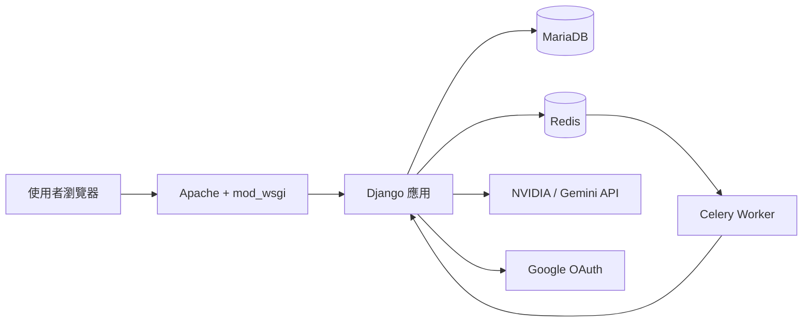
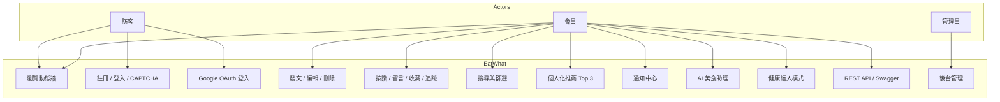
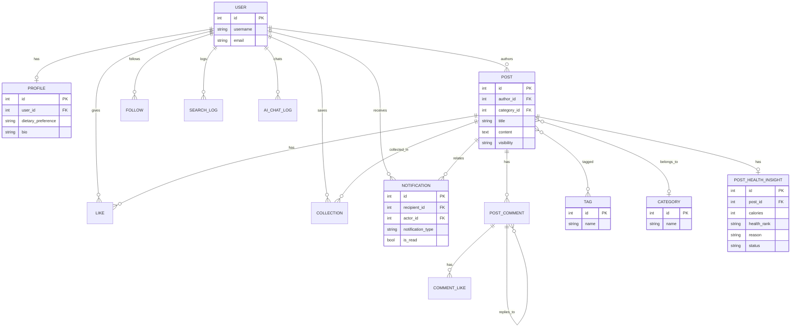
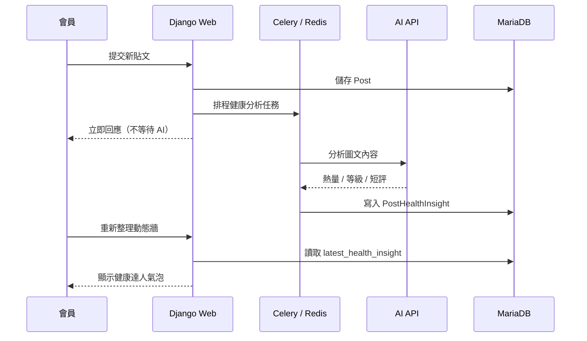
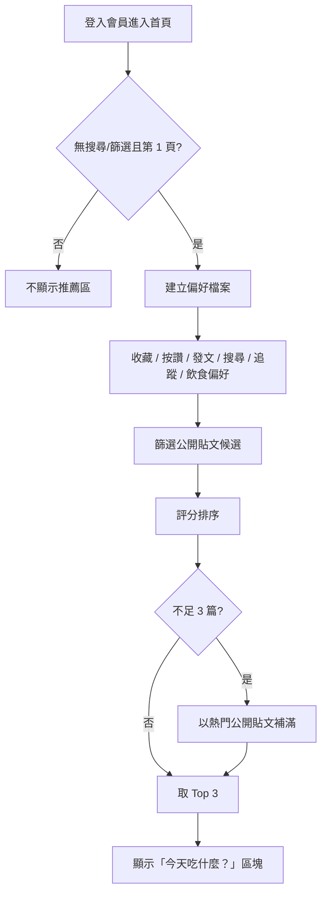

# EatWhat 報告用圖表（Mermaid）

可直接複製到支援 Mermaid 的編輯器（GitHub、Typora、VS Code 外掛），或匯出成 PNG 貼進 Word / PowerPoint / Notion。

## 已匯出的 PNG（最新版）

| 圖表 | PNG 檔案 | Mermaid 原始檔 |
| --- | --- | --- |
| Use Case 用例圖 | [notion/images/use_case.png](notion/images/use_case.png) | [diagrams/use_case.mmd](diagrams/use_case.mmd) |
| ERD 實體關聯圖 | [notion/images/erd.png](notion/images/erd.png) | [diagrams/erd.mmd](diagrams/erd.mmd) |
| 系統架構圖 | [notion/images/architecture.png](notion/images/architecture.png) | [diagrams/architecture.mmd](diagrams/architecture.mmd) |
| 健康分析流程 | [notion/images/health_flow.png](notion/images/health_flow.png) | [diagrams/health_flow.mmd](diagrams/health_flow.mmd) |
| 推薦流程圖 | [notion/images/recommendation_flow.png](notion/images/recommendation_flow.png) | [diagrams/recommendation_flow.mmd](diagrams/recommendation_flow.mmd) |

**Notion 完整文件：** [notion/EatWhat_Notion.md](notion/EatWhat_Notion.md)（含匯入教學 [notion/README.md](notion/README.md)）

---

## 1. 系統架構（部署）

---

## 2. 用例圖（Use Case）

---

## 3. ERD（實體關聯圖）

---

## 4. 發文與健康分析流程

---

## 5. 個人化推薦流程

---

## 匯出成圖片的方式

1. **GitHub**：將本檔 push 後在 repo 內預覽，截圖 Mermaid 區塊
2. **Mermaid Live Editor**：<https://mermaid.live/> 貼上程式碼後 Export PNG/SVG
3. **VS Code**：安裝 Mermaid 外掛後預覽並匯出
